# Database

All tables live in a single SQLite file (`DATABASE_PATH` in production).
Relationships between users and apps (consents, roles) are always
`(user, app)` pairs: a user has one consent and at most one role per app.

```mermaid
erDiagram
    users {
        int id PK
        string email "unique, not null, case-insensitive"
        string hashed_password "nullable: nil for magic-link-only"
        boolean is_admin "default false"
        utc_datetime confirmed_at "nullable"
        string totp_secret "nullable: TOTP setup secret"
        boolean totp_enabled "default false"
        boolean email_2fa_enabled "default false"
        utc_datetime inserted_at
        utc_datetime updated_at
    }

    users_tokens {
        int id PK
        int user_id FK "not null, on_delete: delete_all"
        binary token "not null, 32 bytes"
        string context "not null: session|login|oauth_code|refresh|change:*|jti_revoked"
        string sent_to "nullable: email for email-context tokens"
        string meta "nullable: JSON (scopes, app, code_challenge)"
        utc_datetime authenticated_at "nullable"
        utc_datetime inserted_at
    }

    recovery_codes {
        int id PK
        int user_id FK "not null, on_delete: delete_all"
        string code_hash "not null: bcrypt hash"
        boolean used "default false"
        utc_datetime inserted_at
    }

    user_passkeys {
        int id PK
        int user_id FK "not null, on_delete: delete_all"
        binary credential_id "WebAuthn credential id"
        binary public_key "COSE public key"
        int sign_count "default 0"
        string label "nullable"
    }

    federated_identities {
        int id PK
        int user_id FK "not null, on_delete: delete_all"
        string provider "e.g. google"
        string subject "provider-side user id"
        string email "email reported by the provider"
    }

    apps {
        int id PK
        string slug "unique, the OAuth client_id"
        string name
        string callback_url
        string launch_url "nullable"
        string logo_url "nullable: login page branding"
        string brand_color "nullable: hex, login page branding"
        array allowed_roles "default [user, admin]"
        boolean first_party "default false"
        binary client_secret_hash "SHA-256, nullable for public clients"
    }

    app_user_roles {
        int id PK
        int app_id FK "not null, on_delete: delete_all"
        int user_id FK "not null, on_delete: delete_all"
        string role "one of the app's allowed_roles"
    }

    consents {
        int id PK
        int user_id FK "not null, on_delete: delete_all"
        int app_id FK "not null, on_delete: delete_all"
        array scopes "granted scopes"
        utc_datetime granted_at
        utc_datetime expires_at
    }

    settings {
        int id PK
        string key "unique"
        string value "secrets stored Phoenix.Token-encrypted"
    }

    webhook_endpoints {
        int id PK
        string url "http(s) only"
        string secret "plaintext: HMAC key for you-signature"
        array events "subscribed event names"
        boolean enabled "default true"
    }

    users ||--o{ users_tokens : ""
    users ||--o{ recovery_codes : ""
    users ||--o{ user_passkeys : ""
    users ||--o{ federated_identities : ""
    apps ||--o{ app_user_roles : ""
    users ||--o{ app_user_roles : ""
    apps ||--o{ consents : ""
    users ||--o{ consents : ""
```

## Indexes

| Table | Index | Columns | Unique |
|-------|-------|---------|--------|
| `users` | `users_email_index` | `email` | Yes |
| `users_tokens` | `users_tokens_user_id_index` | `user_id` | No |
| `users_tokens` | `users_tokens_context_token_index` | `context, token` | Yes |
| `recovery_codes` | `recovery_codes_user_id_index` | `user_id` | No |
| `apps` | `apps_slug_index` | `slug` | Yes |
| `app_user_roles` | `app_user_roles_app_id_user_id_index` | `app_id, user_id` | Yes |
| `consents` | `consents_user_id_app_id_index` | `user_id, app_id` | Yes |
| `settings` | `settings_key_index` | `key` | Yes |

## Context values

The `users_tokens.context` column describes the token's purpose.

| Context | Purpose | Expiry |
|---------|---------|--------|
| `session` | Browser session token | `session_expiry_hours` setting |
| `login` | Magic link token | 15 minutes |
| `oauth_code` | Single-use authorization code | `code_expiry_minutes` setting (default 5) |
| `refresh` | Refresh token (rotated on use) | 60 days |
| `change:{email}` | Email change confirmation | 7 days |
| `jti_revoked` | JWT revocation blocklist entry | Permanent (until JWT expires) |

The `users_tokens` table doubles as the JWT revocation blocklist.
When a JWT is revoked (via `POST /oauth/revoke` or `You.SDK.revoke_token/1`),
the JTI is SHA-256 hashed and inserted with `context: "jti_revoked"`.
`JWT.verify/1` checks this table before accepting any token.

## Token `meta`

`oauth_code` and `refresh` tokens carry a JSON `meta` blob:

- `scopes`: the granted scopes
- `app`: the slug of the app the token was issued for, when known. This is
  what lets the `roles` scope resolve to the user's per-app role
  (`app_user_roles`) instead of the global admin flag.
- `code_challenge` (oauth_code only): PKCE challenge verified at exchange.

## Notes

- `users.email` uses `collate: :nocase` for case-insensitive lookups.
- `users.hashed_password` is nullable because users can register via magic link without setting a password.
- Recovery codes (`recovery_codes.code_hash`) are bcrypt-hashed. The plaintext codes are shown once at setup, never stored.
- `users_tokens.token` stores raw bytes for session tokens and SHA-256 hashes for email tokens. The unique index on `(context, token)` prevents duplicates.
- `apps.client_secret_hash` is a SHA-256 hash; the plaintext secret is shown once at creation or rotation.
- `webhook_endpoints.secret` is stored in plaintext because it is the HMAC key used to sign deliveries; it is shown once in the console.
- Secret `settings` values (Erlang cookie, SCIM token) are stored encrypted with a key derived from `SECRET_KEY_BASE`.
- Array columns (`allowed_roles`, `scopes`, `events`) are stored as JSON.
