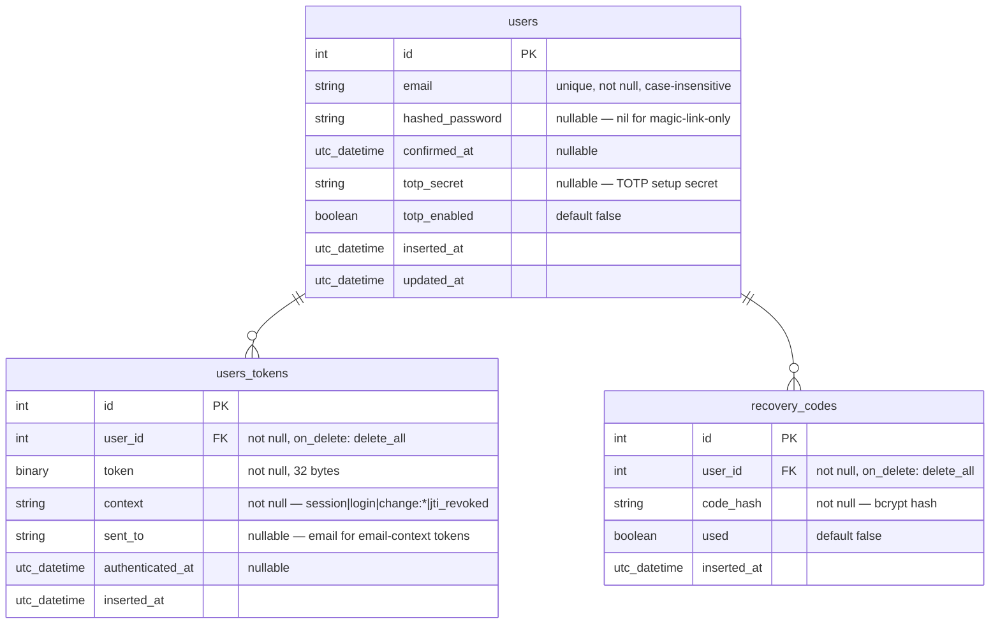

# Database

## Indexes

| Table | Index | Columns | Unique |
|-------|-------|---------|--------|
| `users` | `users_email_index` | `email` | Yes |
| `users_tokens` | `users_tokens_user_id_index` | `user_id` | No |
| `users_tokens` | `users_tokens_context_token_index` | `context, token` | Yes |
| `recovery_codes` | `recovery_codes_user_id_index` | `user_id` | No |

## Context values

The `users_tokens.context` column describes the token's purpose.

| Context | Purpose | Expiry |
|---------|---------|--------|
| `session` | Browser session token | 14 days |
| `login` | Magic link token | 15 minutes |
| `change:{email}` | Email change confirmation | 7 days |
| `jti_revoked` | JWT revocation blocklist entry | Permanent (until JWT expires) |

The `users_tokens` table doubles as the JWT revocation blocklist.
When a JWT is revoked (via `DELETE /api/logout`), the JTI is SHA-256
hashed and inserted with `context: "jti_revoked"`.
`JWT.verify/1` checks this table before accepting any token.

## Notes

- `users.email` uses `collate: :nocase` for case-insensitive lookups.
- `users.hashed_password` is nullable because users can register via magic link without setting a password.
- Recovery codes (`recovery_codes.code_hash`) are bcrypt-hashed. The plaintext codes are shown once at setup, never stored.
- `users_tokens.token` stores raw bytes for session tokens and SHA-256 hashes for email tokens. The unique index on `(context, token)` prevents duplicates.
